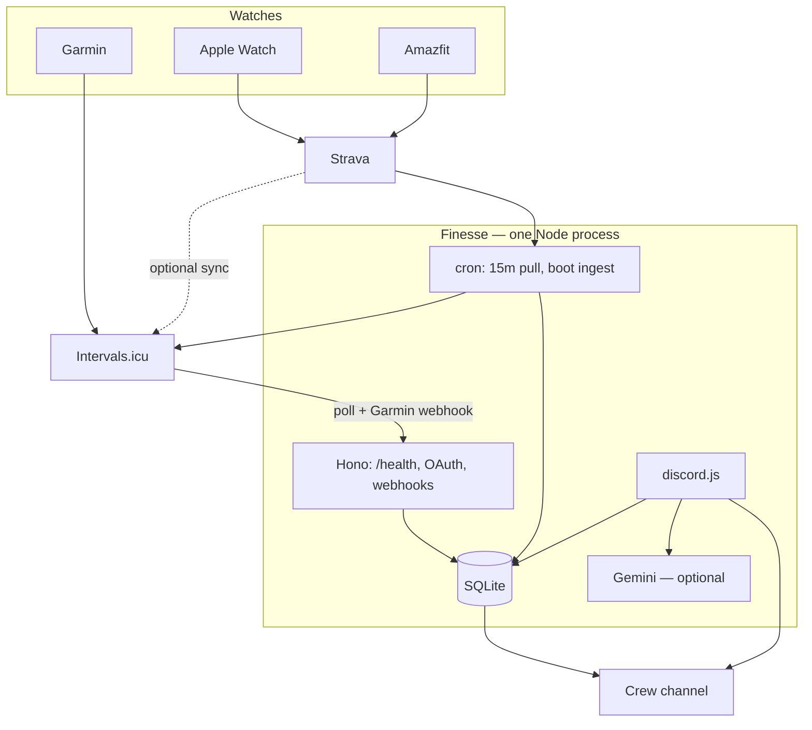

# Finesse

A Discord bot that keeps a small training crew honest. People log a session with `/done` or ✅, Garmin (and friends) can check in automatically, and the channel pings when someone trains.

Product: [docs/prd.md](docs/prd.md). How it is built: [docs/architecture.md](docs/architecture.md).

## What it does

- **One crew channel.** Check-ins, workout pings, Thursday/Saturday nudges, and the Sunday summary all live there.
- **3× per week, one day each.** A second session the same local day still announces in chat; it does not become 2/3 until a new calendar day (`TZ`, default `Australia/Sydney`).
- **Auto from watches.** `/connect` links [Intervals.icu](https://intervals.icu/) (Garmin native; personal API key works today). Strava is optional if you wire OAuth env. Indoor / missed sync: `/done`.
- **Every new workout pings the channel.** Details first (type, name, distance, time), weekly count after:

  ```
  <@you> just worked out: **Run — Easy · 5.2 km · 32 min**
  **1/3** this week
  ```

  The same activity is not posted twice. Pull every 15 minutes, plus once when the process starts. Garmin → Intervals webhooks are near-instant once an OAuth app is approved.
- **Private coach (optional).** `/setup` then `/coach`. Only the asker sees the reply. Gemini if `GEMINI_API_KEY` is set; Sunday falls back to a template if it is not.



## You set this up

The repo is the bot. Discord and hosting accounts have to come from you.

### 1. Node.js

LTS 22.12+ (24 is fine). `node -v`. This repo has `.nvmrc`; if you use nvm: `nvm use`.

### 2. Discord application

1. [Discord Developer Portal](https://discord.com/developers/applications) → New Application → **Finesse**.
2. Bot → Add Bot → Reset Token → `DISCORD_TOKEN`.
3. General Information → Application ID → `DISCORD_CLIENT_ID`.
4. Privileged Gateway Intents: leave them **off**.
5. OAuth2 → URL Generator:
   - Scopes: `bot`, `applications.commands`
   - Permissions: View Channel, Send Messages, Read Message History, Add Reactions, Use Application Commands
6. Open the generated URL, invite the bot into the crew server.

Invite URL if you prefer to paste `CLIENT_ID` yourself:

```
https://discord.com/oauth2/authorize?client_id=CLIENT_ID&permissions=2147546320&scope=bot%20applications.commands
```

### 3. Server IDs

Discord Settings → Advanced → Developer Mode. Then copy IDs:

| Copy from | Env |
|---|---|
| Server (right-click the server name) | `DISCORD_GUILD_ID` |
| The one crew channel | `CHANNEL_ID` |

Use an existing channel or create one (e.g. `#finesse`). Check-ins, nudges, workout pings, and the Sunday summary all live there.

### 4. Env file

```bash
cp .env.example .env
```

Paste the token and IDs. Never commit `.env`.

### 5. Run locally

```bash
pnpm install
pnpm test
pnpm dev
```

In the crew channel: `/join`, `/done chest day`, or react ✅ on a message. `/status` anywhere in the server. `/setup` then `/coach` if Gemini is configured. `/connect` to link Intervals.icu (API key now; OAuth after the app is approved).

Cron does not fire if this laptop sleeps. Use Railway for the real crew.

### 6. Railway (always-on)

1. New project from [github.com/renzoventura/finesse](https://github.com/renzoventura/finesse).
2. Set the same env vars as `.env`.
3. Attach a volume, mount path `/data`.
4. Set `DATABASE_PATH=/data/finesse.sqlite`.
5. One replica only.

Without the volume, every deploy wipes streaks. The Dockerfile is there so `better-sqlite3` builds on Linux. Set `PUBLIC_URL` to the Railway https origin if you want Intervals OAuth or webhooks.

## Intervals.icu (auto check-in)

Two layers, both free:

1. **Poll (works today).** Each person `/connect` and pastes their personal API key from Intervals **Settings → Developer Settings**. Garmin Connect (or Strava) syncs into Intervals; we ask Intervals on boot and every 15 minutes and post **each new workout** in the crew channel. Four HTTP calls per tick. No Intervals app review.
2. **Webhook (near-instant for Garmin).** Intervals only sends `ACTIVITY_UPLOADED` / `ACTIVITY_ANALYZED` to an **OAuth app** the athlete has authorized. Personal API keys cannot subscribe to pings. Strava-originated activities **never** fire webhooks (Intervals docs). Keep the 15-minute pull either way.

### Turn on webhooks

1. Host the bot on Railway (or anything with a public https URL). Laptop `localhost` cannot receive Garmin pings.
2. Logged into Intervals as the app owner, open [intervals.icu/oauth/apply](https://intervals.icu/oauth/apply). The app stays **Pending** until they approve it; OAuth `/connect` will not work until then. You can still copy client id/secret and set the webhook URL while pending.
3. Apply with:
   - Name: `Finesse`
   - Description: Discord accountability bot for a private training crew. Read-only activities so we can mark who trained that day.
   - Website: `https://github.com/renzoventura/finesse`
   - Logo: square PNG ≥ 128×128
   - Privacy policy: `https://github.com/renzoventura/finesse#privacy`
   - Redirect URI: `{PUBLIC_URL}/oauth/intervals/callback` (plus `http://localhost:3000/oauth/intervals/callback` for local)
4. When approved: **Settings → your app → Manage App**. Set webhook URL `{PUBLIC_URL}/webhooks/intervals`, pick a secret, enable **ACTIVITY_UPLOADED** and **ACTIVITY_ANALYZED**. Return body is ignored; we respond **200**.
5. Put `INTERVALS_CLIENT_ID`, `INTERVALS_CLIENT_SECRET`, `INTERVALS_WEBHOOK_SECRET`, and `PUBLIC_URL` in Railway env. Restart. Boot log should show `intervals: oauth+webhook`.
6. Each crew member runs `/connect` and authorizes Finesse with scope `ACTIVITY:READ`. That is what maps `athlete_id` on the ping to their Discord user. If they previously pasted an API key, they should `/connect` again after OAuth is live.
7. Garmin → Intervals.icu (not via Strava) for the ping. Indoor / Amazfit / missed sync: `/done`.

Open [your PUBLIC_URL]/webhooks/intervals in a browser — it should say `ok` once the secret env is set.

## Gemini coach (optional)

Set `GEMINI_API_KEY` (and optionally `LLM_PROVIDER=gemini`, `GEMINI_MODEL`). `/setup` stores level, goal, and weekly target. `/coach` is ephemeral. Sunday 22:00 uses Gemini when the key is present, otherwise the template in `src/templates.ts`. Set `LLM_PROVIDER=none` to turn the coach off.

## Privacy

Finesse is a private Discord bot. Linked Intervals.icu / Strava accounts are used only to see whether a crew member trained and to announce new workouts in the crew channel. We store athlete ids, OAuth/API tokens, and seen activity ids in SQLite on the host. We do not sell data, train models on it, or expose it outside the Discord server. Disconnect by regenerating the Intervals API key or revoking the Finesse app under Intervals settings.

## Plug-in points

- **LLM:** `src/llm/types.ts` (`LlmProvider`). Gemini is `src/llm/gemini.ts`. Set `LLM_PROVIDER=none` to turn the coach off.
- **Activity sources:** `src/sources/types.ts` (`ActivitySource`). Intervals.icu is always on (API key, or OAuth when env is set). Strava is `src/sources/strava.ts` when env is set. Manual `/done` always works. A day counts once toward the week; `source_workouts` still pings every newly seen activity.

## Commands

- `/join` — opt into the weekly crew
- `/done [note]` — log today (in the crew channel)
- `/status` — this week and streaks
- `/setup` — level, goal, weekly target (feeds the coach)
- `/coach` — private session suggestion
- `/connect` — link Intervals.icu (API key, or OAuth when the app is approved) or Strava

✅ on a message in the crew channel logs a check-in for whoever reacted.

## Schedule (`Australia/Sydney` unless `TZ` is set)

- On boot — pull Intervals/Strava; unseen workouts ping the crew channel
- Every 15 minutes — same pull
- Garmin → Intervals webhook — same ping, if OAuth + `PUBLIC_URL` are configured
- Thu 19:00 — check on anyone with 0 this week
- Sat 19:00 — check on anyone with fewer than 2
- Sun 22:00 — weekly summary (LLM if configured, else template)
- Mon 00:00 — streak roll

Post immediately (needs a running bot, or `--dry` to print only):

```bash
pnpm post:summary
pnpm post:nudge
pnpm post:nudge -- --below 1
```

## Scripts

```bash
pnpm test      # db, streaks, ingest, Intervals, templates
pnpm lint      # Biome
pnpm build     # dist/ for Docker
```
