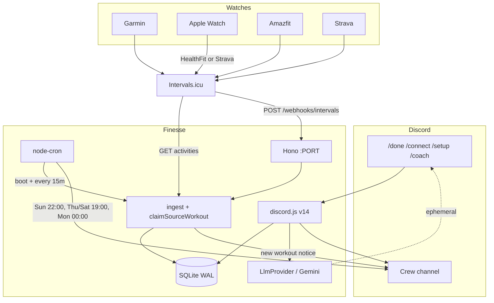
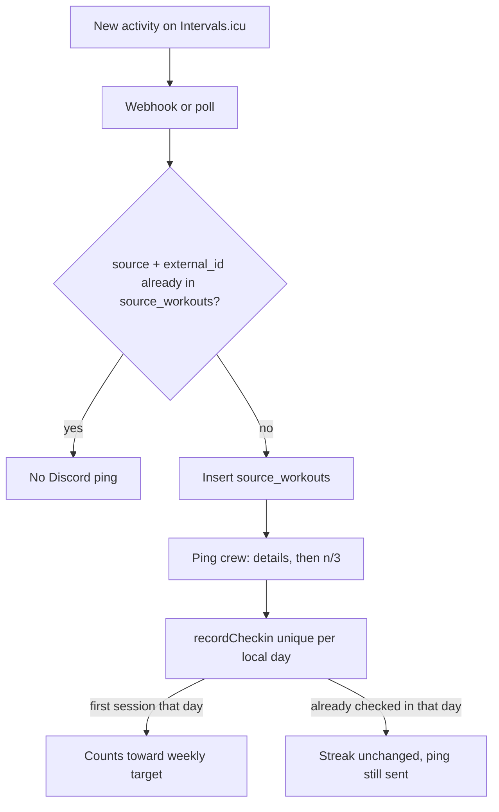
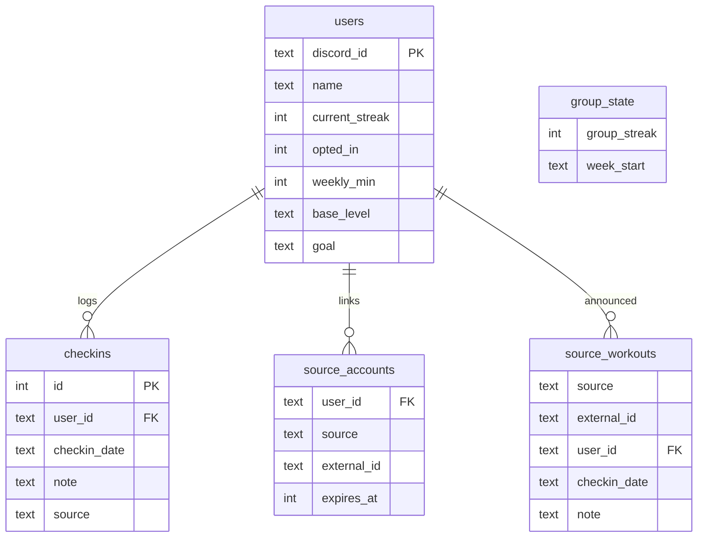

# Finesse architecture

One always-on Node process: Discord gateway + in-process cron + SQLite + a small HTTP server (health, OAuth, Intervals webhooks).



When a workout lands:



## Stack

- TypeScript, Node.js LTS, discord.js v14, better-sqlite3, node-cron, pnpm, tsx, Biome.
- LLM: `@google/genai` behind `LlmProvider` (Gemini Flash-Lite first).
- Activity pull: Intervals.icu (API key and/or OAuth) behind `ActivitySource`. Watches sync into Intervals (Garmin, Amazfit, Strava, Apple Watch via HealthFit or Strava). Hono serves `/health`, `/oauth/intervals/callback`, and `POST /webhooks/intervals`.
- Later: another file that implements the same interface (OpenAI, Garmin, etc.).

## Ports

**LLM** (`src/llm/types.ts`)

```
complete({ system, user }) -> string
```

`createLlmProvider` reads `LLM_PROVIDER`. Unknown values fail fast. Missing Gemini key disables the coach; Sunday falls back to the template.

**Activity source** (`src/sources/types.ts`)

```
authorizeUrl + exchangeCode + refresh   (OAuth: Intervals when env is set)
verifyApiKey + refresh-noop             (API key: Intervals until OAuth is approved)
pull
```

Pulled sessions and Intervals webhooks are written into `checkins` with `source = intervals`. Unique `(user_id, checkin_date)` means an auto-pull cannot double-count `/done` the same day. `source_workouts` records each external activity id so a second session that day still pings the crew channel.

`source_accounts` stores tokens per `(user_id, source)`, so a second wearable is another row, not new user columns.

## Process

```
Member  -- /done or ✅ -->  SQLite (source=manual) + crew channel
Intervals webhook  -- ACTIVITY_UPLOADED -->  SQLite + crew channel
Intervals  -- boot + every 15 min pull -->  SQLite + crew channel
/coach  -- LlmProvider -->  ephemeral reply
node-cron  -- Mon 00:00 reset, Sun 22:00, Thu/Sat 19:00 -->  SQLite / crew channel
```

Slash commands are registered per guild. Intents: `Guilds`, `GuildMessages`, `GuildMessageReactions`. No privileged intents. `/coach` is ephemeral in the server so personal context does not hit the channel.

## Data model



**users** — `discord_id`, `name`, `current_streak`, `opted_in`, `weekly_min`, `base_level`, `goal`

**checkins** — `user_id`, `ts`, `checkin_date`, `note`, `source`, unique `(user_id, checkin_date)`

**group_state** — `group_streak`, `week_start`

**source_accounts** — `user_id`, `source`, `external_id`, tokens, `expires_at`

**oauth_states** — short-lived `/connect` CSRF state

**source_workouts** — `(source, external_id)` of each announced Intervals.icu activity

Calendar math uses the local date string in `TZ`. Week window is `week_start` inclusive to `+7 days` exclusive. Streak hit is `checkins >= weekly_min` per person.

## HTTP

| Method | Path | Why |
|---|---|---|
| GET | `/health` | Railway / uptime |
| GET | `/webhooks/intervals` | Browser check; `ok` when secret env is set |
| POST | `/webhooks/intervals` | Garmin → Intervals activity events |
| GET | `/oauth/:source/callback` | Intervals OAuth return |

## Hosting

SQLite must sit on a persistent volume. Railway volume at `/data`, `DATABASE_PATH=/data/finesse.sqlite`, one replica.

`PUBLIC_URL` must be the public https origin for OAuth and Intervals webhooks: `{PUBLIC_URL}/oauth/intervals/callback`, `{PUBLIC_URL}/webhooks/intervals`.

## Env

See `.env.example`. Discord vars are required. Gemini and Intervals OAuth/webhooks are optional. Intervals API-key `/connect` needs no extra Intervals env. The bot still runs the v0 loop without any of them.

## Source notes

**Intervals.icu.** The only activity source. API-key `/connect` (poll on boot + every 15 minutes + channel ping) or OAuth `/connect` once an app is approved at [oauth/apply](https://intervals.icu/oauth/apply). Webhooks require that OAuth app, `INTERVALS_WEBHOOK_SECRET`, and a public `PUBLIC_URL`. Pings are `ACTIVITY_UPLOADED` / `ACTIVITY_ANALYZED`; Intervals does **not** send them for Strava-originated activities. Garmin and Amazfit → Intervals can webhook; Strava-fed sessions still arrive on the 15-minute pull. Tokens: Intervals OAuth has no refresh token (store `expiresAt` 0). Respond **200** to webhooks (204 used to be retried). Crew watch setup: [crew-setup.md](crew-setup.md).

**Not used.** Strava as a Finesse API (crew Strava accounts connect *inside* Intervals), unofficial Garmin scrapers, HealthKit (needs an iOS app), paid aggregators.
